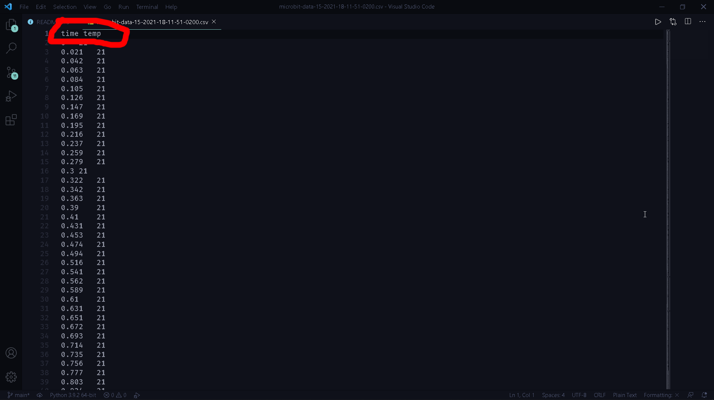
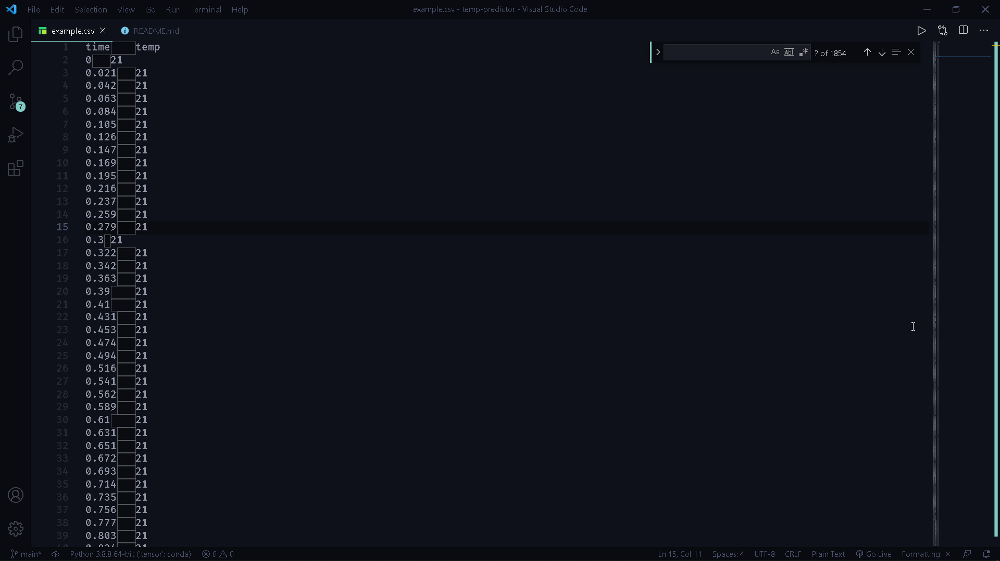

# Micro:bit Temperature Predictor
## What does this projects do?
#### Using a machine learning algorithm known as SVM ("Support Vector Machine"), it predicts the temperature of a micro:bit's CPU using it's previously recorded temperature in a CSV file.
## How do I setup my environment to be able to use this project?
#### First clone this repo using ```git clone https://github.com/Pavlos-Efstathiou/Microbit-Temperature-Predictor```
#### After that run ```pip3 install -r requirements.txt``` if you're on Linux or MacOS and ```pip install -r requirements.txt``` if you're on Windows
#### And to run the script run ```python3 svm_model.py``` if you're on Linux or MacOS and ```python svm_model.py``` if you're on Windows
#### You could also use command line arguments by running this command ```python3 svm_model.py -args [file name] [delimiter] [y column]``` if you're on Linux or MacOS and ```python svm_model.py -args [file name] [delimiter] [y column]``` if you're on Windows
## How could I gather data from my own micro:bit?
#### Visit this [URL](https://makecode.microbit.org/_abfUWEMs3U88) and plug your micro:bit to your computer.
#### Now flash the code to your micro:bit by pressing the "Download" button on the bottom of the page.

#### After that press the "Show Console Device" button. You'll see some output from the console if you executed the last step correctly. That output is the temperature of the micro:bit.


#### Wait a bit to collect a lot of data then press the green button that stops the output

#### Then press the blue button that downloads a CSV file of the data and rename the file to "temp-data" without the quotes.

<!-- ### **Note: the CSV file's seperator should be a comma or else you'll have to modify the code to make it work. I can't figure out a solution** -->
#### You're almost done now. Open the "temp-data.csv" file in your prefered text editor ex. Notepad++, Visual Studio Code, Sublime Text etc. You should see this at the top of the file:

#### **This is the most important step**. Delete the first line. The second line (now the first line) should look like this "time temp". Heres how the first line should look like:

#### It's possible that the first line uses a space while the other lines use a tab or another delimiter. If that's the case replace it. Because if you don't you will encounter an error
#### Example:

#### If thats the case copy the correct delimiter and paste it in the place of the incorrect delimiter.
#### Now all the seperators are correct and the script should work

#### Now move the the CSV file to the directory where you have cloned this repository.
## Does SVM perform good?
#### It's pretty fast. Most times the accuracy is larger than 0.98/1.0
## Please report all bugs and issues you have! 